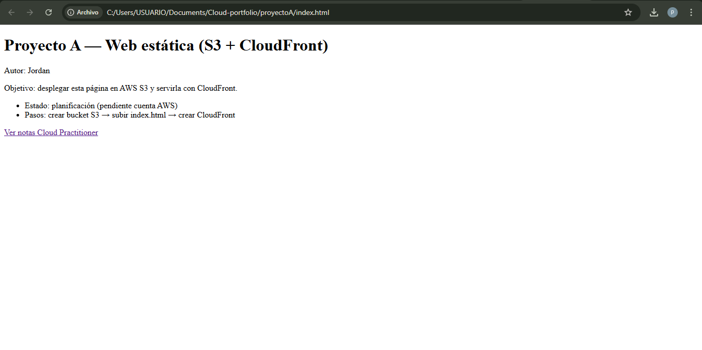

# Proyecto A — Web estática (S3 + CloudFront)

**Autor:** Jordan (GitHub: @Jordan1518)  
**Estado:** Planificado / Preparación (pendiente de crear cuenta AWS)

---

## Descripción
Proyecto de práctica para desplegar una página web estática en AWS S3 y distribuirla mediante CloudFront (CDN).  
Objetivos principales:
- Aprender a preparar y subir contenidos a S3.
- Entender políticas IAM mínimas para seguridad.
- Configurar CloudFront con HTTPS (ACM) y control de costos (CloudWatch / Budgets).

---

## Estructura del proyecto (carpeta `proyectoA/`)
- `index.html` — Página web estática (demo).  
- `cloud_practitioner_notes.md` — Notas del curso AWS Cloud Practitioner.  
- `steps.txt` — Checklist unificado para despliegue en AWS (S3, CloudFront, ACM, control de costos).  
- `iam_policy_s3_putonly.json` — Ejemplo de política mínima para subir/leer objetos en un bucket S3.  
- `monitoring_notes.md` — Notas sobre CloudWatch / CloudTrail.  
- `billing_plan.txt` — Plan de control de costes y alarmas.  
- `today_summary.md` — Resumen de sesiones (historial de aprendizaje).  
- `img/` — Carpeta para capturas de pantalla (añadir imágenes cuando se haga el despliegue o pruebas locales).

---

## Cómo probar localmente (sin AWS)

Puedes ver `index.html` en tu equipo sin necesidad de AWS:

1. Abre una terminal y sitúate en la carpeta `proyectoA/`:

```bash
cd ruta/a/Cloud-portfolio/proyectoA
```

2. Ejecuta un servidor web simple (Python 3):

```bash
python3 -m http.server 8000
```

3. Abre en tu navegador:

```
http://localhost:8000/index.html
```

4. Para detener el servidor: presiona Ctrl+C en la terminal.

---

## Contacto 

GitHub: https://github.com/Jordan1518

---

## Capturas / Evidencia

Guarda capturas en `proyectoA/img/`, por ejemplo:

- `img/local_preview.png` (captura del sitio en localhost)  
- `img/s3_bucket.png` (captura del bucket cuando esté creado)  

Para insertar una imagen en el README:

```markdown

```

---

## Licencia

Este repositorio es para fines educativos. Puedes usarlo y adaptar los pasos para tu aprendizaje.
